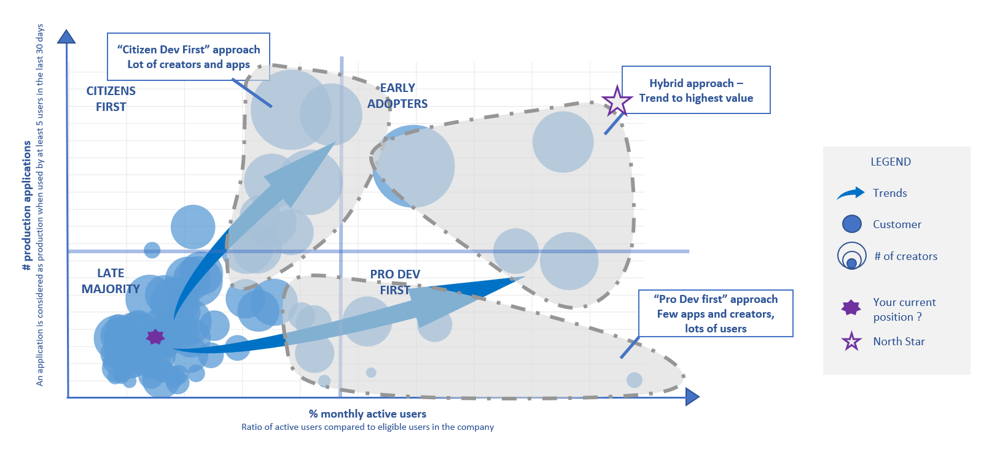
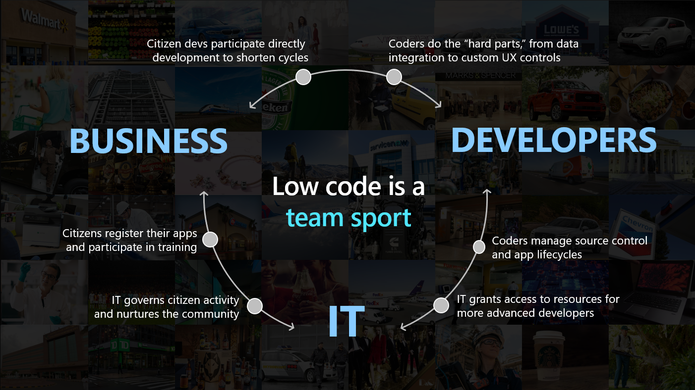

The right strategy for your company will be heavily dependant on your current culture, organization, challenges and goals.  

## Market Trends

To help you build this strategy, let's start by looking at current trends. In the below chart, each bubble represent a customer tenant, with 3 main KPIs :

1. Vertical axis : number of production apps (at least 5 active users in the last 30 days)
1. Horizontal axis : ratio of active users compared to eligible ones
1. Bubble Size : number of makers (users building apps)

Several learning can be extracted from this graph :

1. Majority of companies are at their early stage in their low code journey, probably setting up foundations and preparing for broader rollout
1. When rolling out low code, most companies have a "citizen first" strategy.
1. There are already several companies that now have an hybrid strategy

## Benefits

### Benefits of an hybrid strategy

Low code is a team sport, where everyone can focus on its area of expertise :

1. Business know the process and UI that will best suit their needs
1. Pro dev can handle the complex parts
1. IT governs the platform

### Benefits of a "Citizen dev first" strategy

1. Unlock field innovation
1. Reduce "shadow IT"
1. Efficiently sustain a "Paperless" strategy (reduce error rates, enhance data collection)
1. Last mile apps brings more flexibility where "corporate" solution stop of take months to adapt

### Benefits of a "Pro dev" strategy

1. Reduce development costs
1. Reduce maintenance

