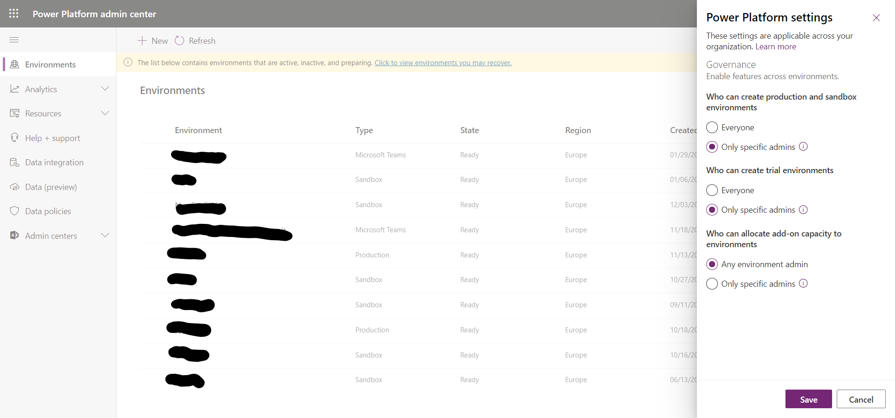

---
#
---
# FOUNDATIONS

The goal of this page is to help admins getting started with basic governance actions.
Whatever your strategy, these are the first steps to apply before moving forward.

## Admin settings

Power Platform Admin center has few settings that you should assess and update quickly to reflect your strategy

| Setting | Default Value | Recommended | Recommendation Reason |
| --- | --- | --- | --- |
| Who can create production and sandbox environments | Everyone | Only Specific admins | Each of these environments will consume a minimum of 1 GB of database storage. Keeping default setting can quickly consume all your available storage. |
| Who can create trial environments | Everyone | Everyone | Trials do not consume any storage, and can easily be submitted to the same restrictions (DLP) as the default environment. We do not see significant risk to keep default setting. However, some organization will prefer to force users to request trials through IT. They will change this setting, and that's fine too.|
| Who can allocate add-on capacity to environments | Everyone | Only Specific admins | Typical deployment strategies delegate environment administration to multiple admins. Restricting capacity allocation will ensure central administration stays in control of purchased add-ons.|

## Self service capabilities

Power Platform propose some **self-service** capabilities that individuals can use without asking their organization. Changing these settings requires admin actions using PowerShell command lines.

| Capability | What it means | Setting name | Can target specific products | Default Value | How to change it |
| --- | --- | --- | --- | --- | --- |
| Trials | Individuals can **try** some of Power Platform capabilites | AllowAdHocSubscriptions | NO - This setting applies to **all** Microsoft cloud-based apps and services | true  | [Enable or disable self-service sign-up for your organization](https://docs.microsoft.com/en-us/powershell/module/msonline/set-msolcompanysettings?view=azureadps-1.0#parameters) |
| Self Purchase | Individuals can **buy** Power Platform licenses | AllowSelfServicePurchase | YES - Command can run on all products, or specific ones | It depends. [View a list of self-service purchase products and status](https://docs.microsoft.com/en-us/microsoft-365/commerce/subscriptions/allowselfservicepurchase-powershell?view=o365-worldwide#view-a-list-of-self-service-purchase-products-and-their-status)  |  [Set the status for AllowSelfServicePurchase](https://docs.microsoft.com/en-us/microsoft-365/commerce/subscriptions/allowselfservicepurchase-powershell?view=o365-worldwide#view-or-set-the-status-for-allowselfservicepurchasen) |

## Default Connectivity

Power Platform includes hundreds of connectors. Limiting connectors available by default is a good practice. The easiest way to do this is to create a DLP that will apply to all your environments, except some used by experienced and trained individuals. This will ensure that :

- **Default** environment, where everyone can create things, is restricted to low risk and easy to use connectors (for example, those using Office 365 data)
- **Any new** environment will automatically have be submitted to this DLP. This includes any type of environments (trials, developer, etc)
To help you build the DLP that best suits your needs, you can discover connectors and even slice and dice them based on their properties in [this report](https://aka.ms/ppc)

## Cross tenant connectivity

WORK IN PROGRESS - TO BE COMPLETED
Decide if you want to restrict users from connecting to/from other tenants

## Teams capabilities

WORK IN PROGRESS - TO BE COMPLETED
Decide if you want to restrict usage of Power Platform capabilities seeded in Teams

## Monitoring

WORK IN PROGRESS - TO BE COMPLETED
Install core module of CoE Starter Kit to have deeper insights on what is occuring on your tenant
